# 🎬 MovieLens SQL Case Study  

A SQL case study analyzing movies & ratings from the **MovieLens dataset** with 17 queries.  

---

## 📂 Dataset Overview  
- **P2_Movie** → Movies with title & genres(https://www.kaggle.com/datasets/merveatasoy1/movielens-dataset?select=movie.csv)
- **P2_Rating** → User ratings (1–5)  
- **P2_Link** → Links to IMDb & TMDB IDs  

---

## ✅ Queries & Outputs  

| No | Question | Demo |
|----|-----------|------|
| Q1 | How many movies are there in the dataset? | 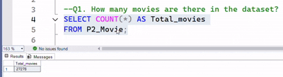 |
| Q2 | How many total ratings are present? | 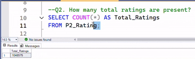 |
| Q3 | How many unique users have rated movies? | 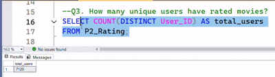 |
| Q4 | Show the first 10 movies. | 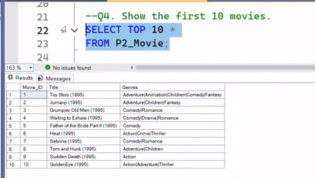 |
| Q5 | What is the overall average rating? | 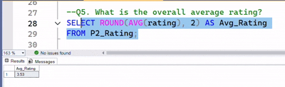 |
| Q6 | Which 10 movies received the most ratings? | 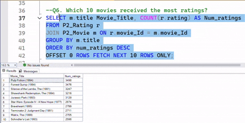 |
| Q7 | Which 10 movies have the highest average rating (min 1000 ratings)? | 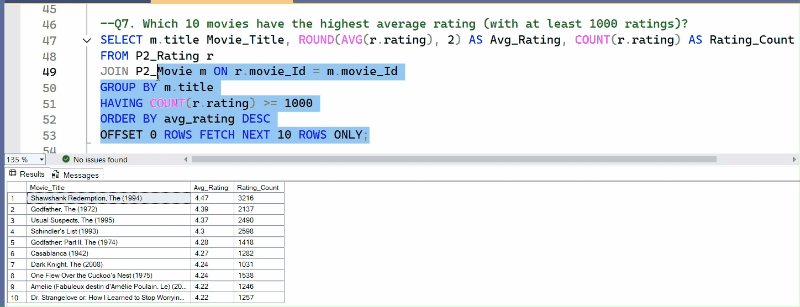 |
| Q8 | How many ratings has each user given? | 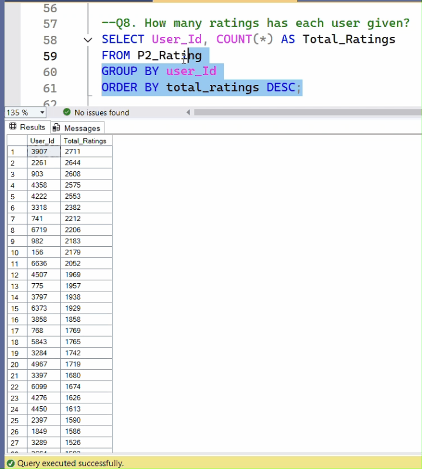 |
| Q9 | How many movies exist in each genre? |  |
| Q10 | Which movies have the longest titles? |  |
| Q11 | Which 10 movies received the highest number of ratings? | 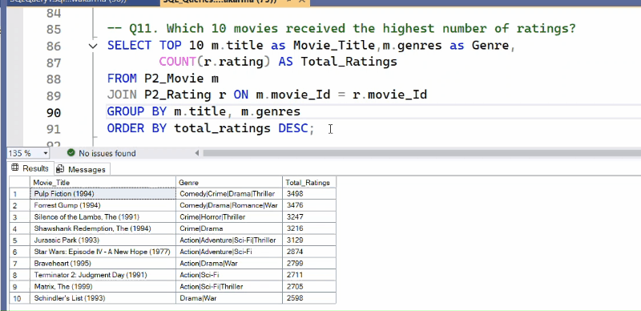 |
| Q12 | What is the distribution of ratings (count & percentage)? | 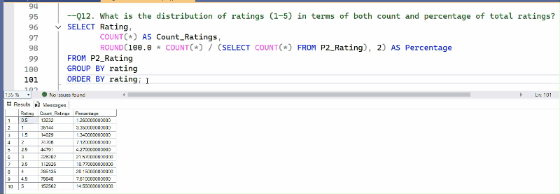 |
| Q13 | Show all movies that belong to either Comedy or Action genre. |  |
| Q14 | Which movies are most controversial (highest variance, min 500 ratings)? | 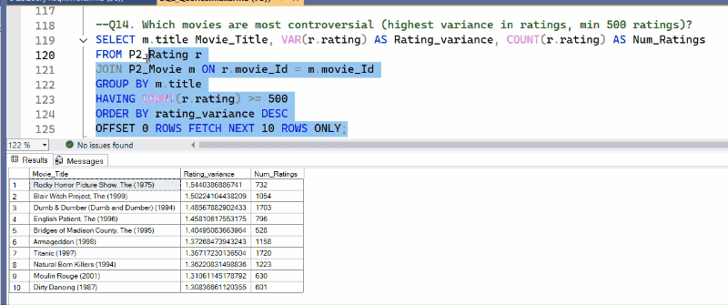 |
| Q15 | How many movies are missing IMDb IDs in Links? | 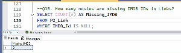 |
| Q16 | Show movies that are either highly rated (avg ≥ 4.5) or very popular (≥ 5000 ratings). | 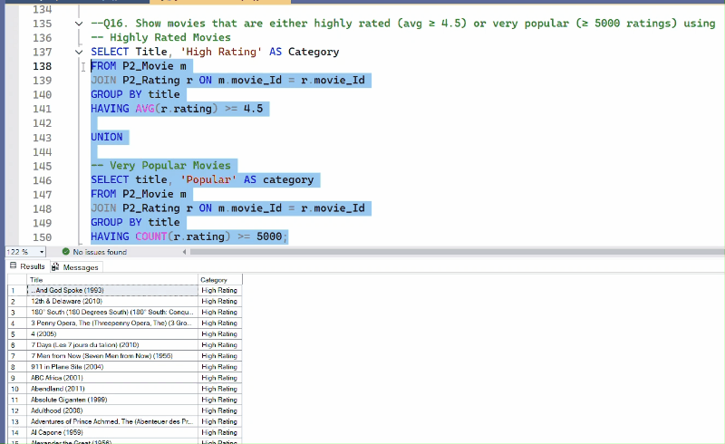 |
| Q17 | Top 5 users who gave the highest average rating (min 20 ratings). | 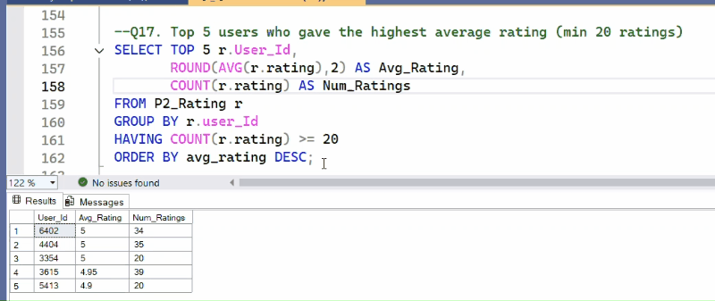 |

---

## 📊 Key Learnings  
- Writing **SQL queries step by step**  
- Using **GROUP BY, HAVING, ORDER BY, UNION, VAR, ROUND**  
- Understanding **movie ratings analysis** with a real-world dataset  

---

## ⚡ How to Use  
1. Clone this repo  
   ```bash
   git clone https://github.com/your-username/MovieLens-SQL-CaseStudy.git
